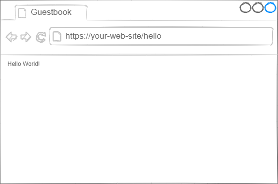

# Learn by Doing: "Guestbook"

## Task #2: Hello World Web App

A web browser works like TV. Satellites transmits TV signals and TV intercepts this signals via antenna and display videos to us.

A web browser fetchs content from a web server by using your network card and renders or downloads the content to us.

We will implement a very basic web server with Python. 

The web server should send a simple text message to us.





Source: [https://developer.mozilla.org/en-US/docs/Learn/Common_questions/What_is_a_URL](https://developer.mozilla.org/en-US/docs/Learn/Common_questions/What_is_a_URL)


## Task Definition

You should use Flask, a micro web framework.

- Install Python: [https://www.python.org/downloads/](https://www.python.org/downloads/)
- Create your project folder and initialize a virtual environment.
[https://flask.palletsprojects.com/en/2.0.x/installation/#virtual-environments](https://flask.palletsprojects.com/en/2.0.x/installation/#virtual-environments)
- Install Flask: [https://flask.palletsprojects.com/en/2.0.x/installation/#install-flask](https://flask.palletsprojects.com/en/2.0.x/installation/#install-flask)

### Create your web app

- Create a file named `hello.py`

```python
from flask import Flask
app = Flask(__name__)

@app.route("/hello")
def hello_world():
    return "<p>Hello, World!</p>"
```


Open a Powershell terminal and navigate to your project folder with:


cd your-project-path

Type and execute

```
$env:FLASK_APP = "hello"
```

This will define and set `FLASK_APP` environment variable which will persist on this PowerShell session

Run your app with flask or:

```
flask run
 * Running on http://127.0.0.1:5000/
```

Or:

```
python -m flask run
 * Running on http://127.0.0.1:5000/
```

Upon navigating the [http://127.0.0.1:5000/hello](http://127.0.0.1:5000/hello) the URL, your browser should show "Hello World!" message.
